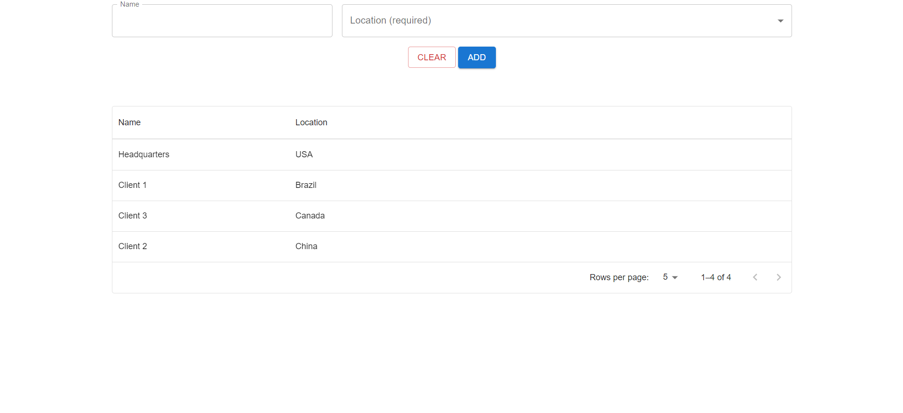

# react-interview-q1 -- Test Project Assignment

## Candidate: **Igor Soloydenko**

* LinkedIn: https://www.linkedin.com/in/igorsoloydenko/
* GitHub: https://github.com/another-guy
* StackOverflow: https://stackoverflow.com/users/482868/igor-soloydenko

## How to run the project

**❗❗❗MAKE SURE THE COMMANDS ARE EXECUTED IN `solutions` SUBDIRECTORY.**

Execute commands in bash:

```sh
cd solution
pnpm install
pnpm start
```

Open http://localhost:3000 in your browser.

## What's DONE and NOT done:



**❗❗❗Please, find my comments in code by searching for `Igor's comment`.**

* Responsive form with the Name and Location fields with basic validation using mock API field.
* Table with the list of Name/Location pairs.
* Libraries used:
  * MUI — UI component library.
  * react-hook-form — dealing with HTML forms in React.
  * yup — HTML form validation.
* Features NOT implemented:
  * Application state is handled via `useContext` + `useReducer` (and `useState` is used for Component state).
    * Would use: Redux, MobX, XState, Zustand, or others.
  * Loading state, API caching.
    * Would use: react-query, SWR, or alike.
  * Error handling.
    * Need some better UX: toasts, notification bars, etc.
  * Human-friendly UX: a11y, i18n, l10n.
  * Exhaustive error handling.
  * Production-ready UX (e.g. keyboard debouncing to avoid request throttling by the server).
* Non-feature measures:
  * Automated testing.
    * React testing library, Jest/Vitest.

## Original Instructions

Fork this repo first into your own github account. Make sure to thoroughly read the instructions and implement the react component to meet the provided requirements. Send back a link to your cloned repo. You are expected to make implementation choices around customer experience and efficiency. Please make sure to explain your choices in comments.

## Original Requirements

Please build the following form component


* Name input should be validated using the provided mock API to check whether the chosen name is taken or not.
* Name input should be validated as the user is typing.
* Location dropdown options should be fetched using the provided mock API.
* Component should have a responsive layout
* Component should be appropriately styled
* Unit tests are not required